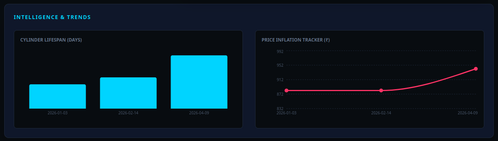
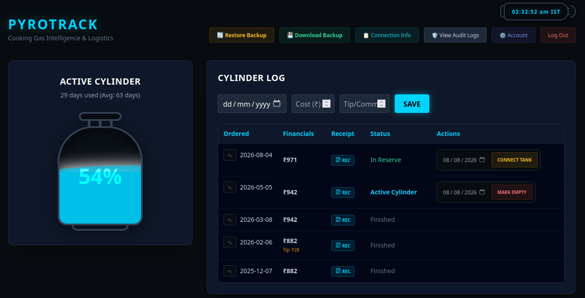

# 🔥 PYROTRACK

> A privacy-first, zero-trace platform for cooking gas utilization monitoring and delivery tracking, built with data sovereignty in mind.


Pyrotrack is a comprehensive, self-hosted household logistics platform. It transforms standard gas cylinder management into a visually rich, data-driven dashboard. Built specifically for privacy and single-container Docker deployment, Pyrotrack ensures your data never leaves your personal vault.

---

## 📸 Screenshots

### 📊 Live Dashboard & Tank Visualizer
> *The fluid-animated LPG cylinder, live Indian Standard Time (IST) clock, and intelligence trends.*
 <!-- ⚠️ Note: Create a 'docs' folder in your repo and place your dashboard.png image there -->

### 📋 Data Grid & Connection Vault
> *The centralized cylinder log, financial tracking, receipt vault, and one-time agency metadata.*
 <!-- ⚠️ Note: Place your data-page.png image in the 'docs' folder -->

---

## ✨ Key Features

*   **📊 Smart Logistics & Lifespan Tracking:** Track the exact lifecycle of your cylinders from `Ordered` ➔ `In Transit` ➔ `Received` ➔ `Connected` ➔ `Empty`.
*   **💸 Deep Financial Tracking:** Log cylinder costs alongside delivery boy commissions/tips to monitor household inflation over time.
*   **🧾 Integrated Receipt Vault:** Securely upload and attach PDF or image receipts directly to individual delivery records.
*   **⏱️ Live Animated Dashboard:** Features a fluid-animated LPG cylinder that visually represents your remaining gas based on historical burn-rate averages, complete with a live horizontal Indian Standard Time (IST) clock.
*   **🔐 Multi-User Secure Vault:** Full JWT authentication and bcrypt password hashing. Create unique accounts with strict data isolation or share a household account.
*   **📋 Centralized Connection Profile:** Store one-time agency metadata (Brand, Consumer #, Delivery Boy details) independently from individual orders to keep your database clean and normalized.
*   **🛡️ Immutable Audit Logging:** A built-in security viewer tracks every `CREATE`, `UPDATE`, `DELETE`, and `UPDATE_PROFILE` action with exact timestamps.
*   **💾 Smart Backup & Self-Healing Restore:** Download your entire database and receipt vault as a single `.zip` file. Restoring a backup automatically reboots the backend server and injects missing database columns to support legacy data gracefully.

---

## 🛠️ Technology Stack

| Architecture | Technologies Used |
| :--- | :--- |
| **Frontend** | React 18, Vite, Tailwind CSS, Framer Motion (Animations), Recharts (Data Visualization) |
| **Backend** | Python 3.11, FastAPI, SQLAlchemy (Async), PyJWT, Bcrypt |
| **Database** | SQLite (aiosqlite) with Write-Ahead Logging (WAL) enabled |
| **Deployment** | Docker, Docker Compose (Multi-stage build consolidating static frontend into FastAPI) |

---

## 🚀 Getting Started

Pyrotrack is designed to be deployed instantly using Docker Compose (ideal for Portainer or local home servers).

### 1. The `docker-compose.yml`
Ensure your compose file is configured to run in your local timezone (e.g., `Asia/Kolkata`) so the audit logs and backups are timestamped accurately.

```yaml
version: '3.8'

services:
  pyrotrack:
    build:  
      context: .
      dockerfile: Dockerfile
    container_name: pyrotrack_app
    ports:
      - "8088:8000"
    environment:
      - TZ=Asia/Kolkata
    volumes:
      - pyrotrack_db:/app/data
    restart: unless-stopped

volumes:
  pyrotrack_db:
```

### 2. Deployment

Clone the repository and spin up the container:
```bash
git clone https://github.com/Code-geass21/pyrotrack.git
cd pyrotrack
docker-compose up -d --build

```

Access the application at `http://localhost:8088`.

---

## 📦 Backup & Recovery Mechanics

Pyrotrack features a robust data sovereignty system:

1. **To Backup:** Click the `💾 Download Backup` button in the UI. This triggers a WAL checkpoint and packages your SQLite database and all uploaded receipts into a timestamped `.zip` file.
2. **To Restore:** Click `🔄 Restore Backup`. The application will safely drop database connections, extract your `.zip` over the active files, and gracefully exit the container. Docker's `unless-stopped` policy will instantly reboot the app with your restored data.

*(Note: Restoring a backup will overwrite current data. Ensure you log in with the credentials that were active at the time the backup was created.)*

---

## 📄 License

This project is built for personal data sovereignty. Feel free to fork, modify, and host it on your own private infrastructure.

```

```
